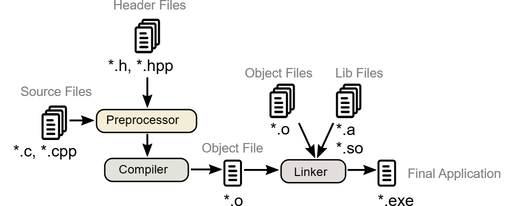

# C++ 

## 1.  C++ Build Process




As C++ programmers, we primarily work with source (.cpp) and header (.h) files during development. The build process consists of three main stages:

#### 1. Preprocessing
- Processes all preprocessor directives (like `#include`, `#define`)
- Includes necessary header files from the file system
- Prepares the code in a ready-to-be-compiled form

#### 2. Compilation
- Converts the preprocessed code into machine code
- Processes each source file separately
- Some compilers (like GCC) first generate assembly code before machine code

#### 3. Linking
- Combines all compiled object files
- Incorporates precompiled object files and libraries
- Produces the final executable file ready for execution

This multi-stage process transforms our human-readable code into a program that can be run on a computer.

## 2. Hello World Program

```cpp
#include <iostream>

int main() {
    std::cout << "Hello, World!" << std::endl;
    return 0;
}
```

### Understanding the Components:

#### 1. `#include <iostream>`
- Includes the Input-Output Stream library
- Provides essential I/O functionalities like `std::cout`, `std::cin`, and `std::cerr`
- Required for any program that needs to display output or read input

#### 2. `std::` Namespace
- `std::` prefix indicates we're using elements from the C++ Standard Library namespace
- Helps avoid naming conflicts in larger programs
- Alternative approach: `using namespace std;` (though generally discouraged in larger codebases)

#### 3. `return 0;` Statement
- Indicates successful program execution to the operating system
- Non-zero return values typically indicate errors
- In modern C++, `main()` implicitly returns 0 if no return statement is provided

__Did you really think I would just type out cout << "Hello, World!"; like some beginner? Nah, I prefer to overanalyze every tiny detail and make sure you understand why we even say hello to the world in the first place! 😆__

#### C++ Compilation Command
`g++ -std=c++17  -Werror 01.hello_world.cpp -o prog && ./prog`
> **Note**: `-Werror` can be used during compilation to treat warnings as errors.

> **Note:** `-std=c++17` specifies the C++ standard version, with available versions including C++11, C++14, C++17, C++20, C++23, and the upcoming C++26, each introducing new features and improvements.

