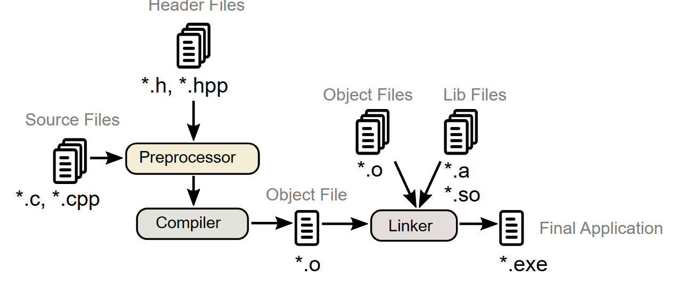

# C++ 

## 1.  C++ Build Process




As C++ programmers, we primarily work with source (.cpp) and header (.h) files during development. The build process consists of three main stages:

#### 1. Preprocessing
- Processes all preprocessor directives (like `#include`, `#define`)
- Includes necessary header files from the file system
- Prepares the code in a ready-to-be-compiled form

#### 2. Compilation
- Converts the preprocessed code into machine code
- Processes each source file separately
- Some compilers (like GCC) first generate assembly code before machine code

#### 3. Linking
- Combines all compiled object files
- Incorporates precompiled object files and libraries
- Produces the final executable file ready for execution

This multi-stage process transforms our human-readable code into a program that can be run on a computer.

## 2. Hello World Program

```cpp
#include <iostream>

int main() {
    std::cout << "Hello, World!" << std::endl;
    return 0;
}
```

### Understanding the Components:

#### 1. `#include <iostream>`
- Includes the Input-Output Stream library
- Provides essential I/O functionalities like `std::cout`, `std::cin`, and `std::cerr`
- Required for any program that needs to display output or read input

#### 2. `std::` Namespace
- `std::` prefix indicates we're using elements from the C++ Standard Library namespace
- Helps avoid naming conflicts in larger programs
- Alternative approach: `using namespace std;` (though generally discouraged in larger codebases)

#### 3. `return 0;` Statement
- Indicates successful program execution to the operating system
- Non-zero return values typically indicate errors
- In modern C++, `main()` implicitly returns 0 if no return statement is provided

__Did you really think I would just type out cout << "Hello, World!"; like some beginner? Nah, I prefer to overanalyze every tiny detail and make sure you understand why we even say hello to the world in the first place! 😆__

#### C++ Compilation Command
`g++ -std=c++17  -Werror 01.hello_world.cpp -o prog && ./prog`
> **Note**: `-Werror` can be used during compilation to treat warnings as errors.

> **Note:** `-std=c++17` specifies the C++ standard version, with available versions including C++11, C++14, C++17, C++20, C++23, and the upcoming C++26, each introducing new features and improvements.

## 3. Fundamental Types in CPP

### **1. Integral Types**

| Type Specifier           | Equivalent Type          | Minimum Width (bits) | Signedness | Description |
|--------------------------|-------------------------|----------------------|------------|-------------|
| `int`                   | `signed int`            | 16                   | Signed     | Basic integer type. Typically 32 bits on modern systems. |
| `unsigned`              | `unsigned int`          | 16                   | Unsigned   | Non-negative integer type. |
| `short`                 | `short int`             | 16                   | Signed     | Optimized for space. |
| `unsigned short`        | `unsigned short int`    | 16                   | Unsigned   | Optimized for space. |
| `long`                  | `long int`              | 32                   | Signed     | At least 32 bits. |
| `unsigned long`         | `unsigned long int`     | 32                   | Unsigned   | At least 32 bits. |
| `long long` (C++11)     | `long long int`         | 64                   | Signed     | At least 64 bits. |
| `unsigned long long`    | `unsigned long long int` | 64                  | Unsigned   | At least 64 bits. |
| `signed char`           | `signed char`           | 8                    | Signed     | Smallest signed integer type. |
| `unsigned char`         | `unsigned char`         | 8                    | Unsigned   | Smallest unsigned integer type. |

### **2. Extended Integer Types** (Implementation-Defined)

| Type            | Description |
|----------------|-------------|
| `std::size_t`  | Unsigned integer type for `sizeof` and `alignof`. |
| Fixed-width types | Typically aliases of standard integer types. |

---

### **3. Character Types**

| Type Specifier    | Equivalent Type           | Description |
|-------------------|--------------------------|-------------|
| `char`           | `char`                     | Character representation. May be signed or unsigned. |
| `signed char`    | `signed char`              | Signed character representation. |
| `unsigned char`  | `unsigned char`            | Unsigned character representation. |
| `wchar_t`        | `wchar_t`                  | Wide character representation (UTF-16 on Windows, UTF-32 on Linux). |
| `char16_t`       | `std::uint_least16_t`      | UTF-16 character representation. (C++11) |
| `char32_t`       | `std::uint_least32_t`      | UTF-32 character representation. (C++11) |
| `char8_t`        | `unsigned char`            | UTF-8 character representation. (C++20) |

### **Character Type Properties**
- `sizeof(char) ≤ sizeof(short) ≤ sizeof(int) ≤ sizeof(long) ≤ sizeof(long long)`.
- `wchar_t`, `char16_t`, and `char32_t` are distinct types but have same size, alignment, and signedness as corresponding integer types.

---

### **4. Floating-Point Types**

| Type Specifier    | Precision | Format (Typical) | Description |
|------------------|----------|----------------|-------------|
| `float`         | Single   | IEEE-754 binary32 | Single precision, 32-bit floating point. |
| `double`        | Double   | IEEE-754 binary64 | Double precision, 64-bit floating point. |
| `long double`   | Extended | IEEE-754 binary128 / x87 80-bit | Extended precision (varies by implementation). |

### **Floating-Point Type Properties**

| Special Values | Description |
|---------------|-------------|
| `INFINITY`    | Positive and negative infinity. |
| `-0.0`        | Negative zero, useful in arithmetic. |
| `NaN`         | Not-a-number, does not compare equal to anything. |
| `std::nan`    | Quiet NaN value. |

### **Floating-Point Operations**
- Support arithmetic operations (`+`, `-`, `*`, `/`) and functions from `<cmath>`.
- May raise floating-point exceptions and set `errno`.
- Expressions can have extended precision (`FLT_EVAL_METHOD`).
- Some operations modify floating-point environment (e.g., rounding direction).
- Implicit conversions exist between floating-point and integer types.

## 4. The `const` Keyword

```cpp
const float PI = 3.14f;
```

The `const` keyword makes variables **immutable** and doesn't let the variable value change throughout the program. If someone tries to modify a const variable, it throws a compile-time error. The intuition behind using it is when you want to fix a value which you won't be changing throughout your code.

## 5. C++ Block Scope

Block scope in C++ refers to the region of code enclosed by curly braces `{}`. Variables declared inside a block are only accessible within that block and are destroyed when the block ends. This allows you to reuse variable names in different blocks without conflict.

### Example: Block Scope and Variable Shadowing

```cpp
#include <iostream>

int x = 0; // Global variable

int main() {
    {
        int x = 5; // Local variable in this block, shadows global x
        std::cout << "x in first inner scope: " << x << std::endl; // Outputs 5
    }
    {
        int x = 10; // Another local variable, shadows global x
        std::cout << "x in second inner scope: " << x << std::endl; // Outputs 10
    }

    std::cout << "x in global scope: " << x << std::endl; // Outputs 0 (global x)
    return 0;
}
```

### Key Points

- **Block scope**: Any variable declared inside `{}` is only accessible within those braces.
- **Variable shadowing**: A variable declared in an inner block with the same name as an outer variable "shadows" (hides) the outer variable within that block.
- **Global variables**: Declared outside any function or block, accessible throughout the file unless shadowed by a local variable.
- **Curly braces**: Used to define the boundaries of a block and thus the scope of variables.

> **Tip:** Use block scope to limit the lifetime and visibility of variables, making your code easier to read and maintain.

