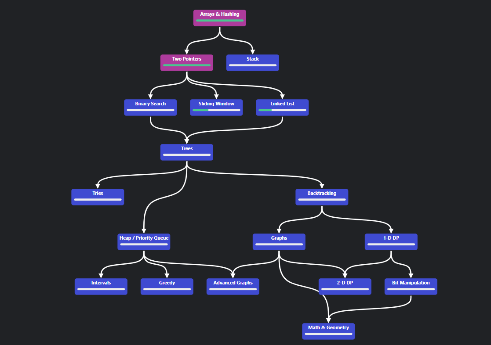
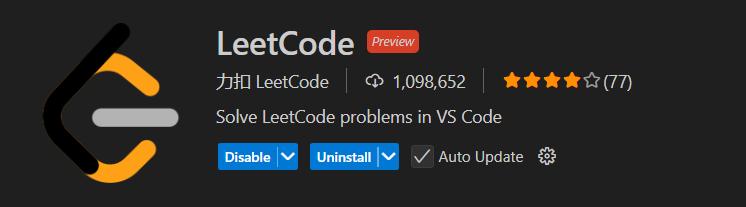

# NEETCODE 250 Solutions USING C++

## Overview

This folder contains comprehensive solutions to the **NEETCODE 250** problems, a curated list of the most important 150 LeetCode questions covering all essential data structures and algorithms concepts for coding interviews.

🔗 [NEETCODE 250](https://neetcode.io/practice?tab=neetcode250) - A structured approach to LeetCode's top interview questions

## Data Structures Covered

- Arrays & Hashing
- Two Pointers
- Sliding Window
- Stack
- Binary Search
- Linked List
- Trees (Binary Trees, Binary Search Trees)
- Tries
- Heap / Priority Queue
- Backtracking
- Graphs
- Dynamic Programming
- Greedy Algorithms
- Intervals
- Math & Geometry

## Solution Features

For each problem, you'll find:

- ✅ Multiple solution approaches (brute force, optimized, etc.)
- ⏱️ Time complexity analysis for each approach
- 🧠 Space complexity analysis
- 📝 Detailed explanations of the thought process
- 🔄 Edge case handling
- 💻 Clean, well-commented code

## How This Helps With Interviews

This collection is designed specifically to help you:

1. Understand the pattern-based approach to problem-solving
2. Recognize when to apply specific data structures and algorithms
3. Learn to optimize from brute force to efficient solutions
4. Articulate your thought process (crucial for interview success)
5. Handle edge cases that are commonly tested in interviews

Happy coding and good luck with your interview preparation! 🚀
## 📚 How to Study This Repository

### 🛣️ Learning Path
The recommended learning path follows the NeetCode roadmap:

*Image credit: This roadmap is taken from neetcode.io and provides a structured approach to mastering algorithmic problems.*

Start with Arrays & Hashing problems, then progress through the topics in order of increasing complexity. The roadmap visually guides you through dependencies between topics, ensuring you build a solid foundation before tackling advanced concepts.

[NeetCode Roadmap](https://neetcode.io/roadmap)

### 🧠 Problem-Solving Cycle

| 🔍 Try First | 📝 Compare | 📈 Optimize | 🔁 Review |
|-------------|-----------|------------|----------|
| Spend 30 min on your solution | Check against provided code | Understand time & space complexity | Revisit after a few days |

### ✨ Level Up Your Skills

* **Track Progress** - Create a personal roadmap ⛰️
* **Spaced Repetition** - Schedule regular reviews 🔄
* **Teach Concepts** - Solidify by explaining to others 👨‍🏫
* **Challenge Yourself** - Modify constraints for extra practice 🏋️‍♂️

> 💡 **Pro Tip**: Focus on patterns, not memorization. The same techniques appear across multiple problem categories!

## Development Environment Setup

### VS Code LeetCode Extension

For a seamless coding experience, this repository was developed using the **LeetCode extension for Visual Studio Code**. This powerful extension allows you to:

- Browse LeetCode problems directly within VS Code
- Code and submit solutions without leaving your editor
- Test your solutions against example test cases
- Track your progress and submission statistics
- Easily organize solutions by difficulty and categories

This setup significantly streamlines the problem-solving workflow and eliminates the need to switch between browser and code editor.

