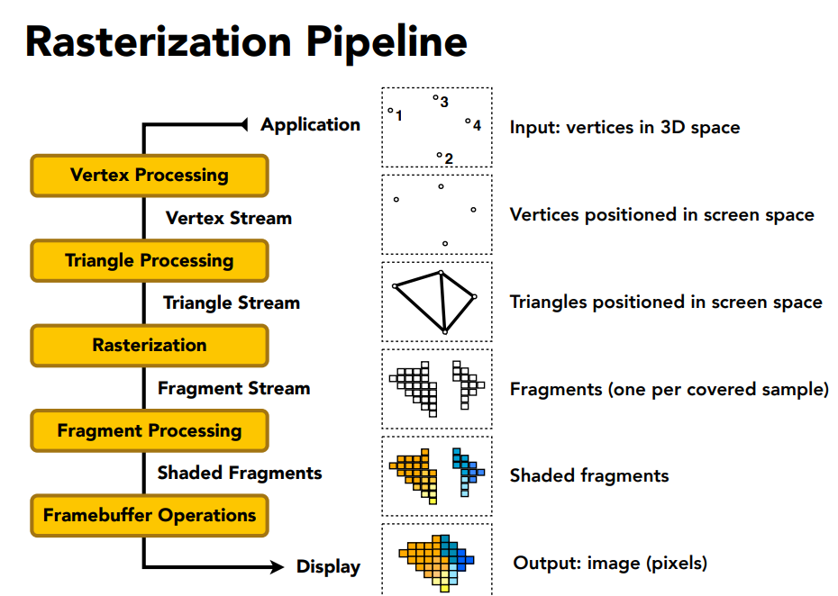

# **Rasterization Pipeline: Turning 3D Models into Pixels**

Alright, let’s talk about **rasterization**—the process that takes a 3D scene and turns it into the 2D image on your screen. If you’ve ever wondered how video games, animations, or interactive graphics actually get displayed, this is the magic behind it!

## Goal
To understand the stages between 3D models and the final 2D image on your screen.

> **Note:** This is a fundamental concept in computer graphics used in video games and interactive applications!

## Why Triangles?

The rasterization pipeline converts all primitives to triangles (even points and lines). Why?
- Can approximate any shape
- Always planar - have a well-defined plane passing through the 3 vertices, which is not true for other polygons
- Well-defined normal vector, which is very important for shading as we often need to know the normal direction
- Easy to interpolate data at corners using barycentric coordinates

The key reason: once everything is reduced to triangles, we can focus on making an extremely well-optimized pipeline for drawing them.

----

### **The Rasterization Pipeline: A Story of Turning Shapes into Pixels**  

Imagine you’re an artist creating a 3D scene on a canvas (your screen). The rasterization pipeline is like an assembly line that takes your 3D models and converts them into the 2D pixels you see. Let’s break it down step by step:  

---

### **1. Application Stage (The Blueprint)**  
- **Input:** Your 3D models (made of vertices, like the corners of a cube).  
- **What Happens:** The CPU prepares the data—positions, colors, textures—and sends it to the GPU. Think of this as sketching the outlines of your scene.  

---

### **2. Vertex Processing (Positioning Everything)**  
- **Input:** Raw 3D vertices (e.g., points in space).  
- **What Happens:**  
  - The GPU moves vertices into their correct positions (using transformations like rotation, scaling).  
  - Projects them onto the 2D screen (like a camera taking a photo).  
- **Output:** A list of vertices in screen coordinates.  

---

### **3. Triangle Processing (Building the Mesh)**  
- **Input:** Processed vertices.  
- **What Happens:**  
  - Vertices are connected into triangles (the basic building blocks of 3D shapes).  
  - Triangles are culled (discarded if they’re facing away or off-screen).  
- **Output:** A stream of triangles ready to be drawn.  

---

### **4. Rasterization (Breaking Triangles into Pixels)**  
- **Input:** Triangles in 2D screen space.  
- **What Happens:**  
  - The GPU scans each triangle and determines which pixels (or **samples**) it covers.  
  - Creates **fragments** (potential pixels with color, depth, etc.).  
- **Output:** A list of fragments (one for each pixel covered by a triangle).  

---

### **5. Fragment Processing (Painting the Pixels)**  
- **Input:** Fragments (not yet final pixels).  
- **What Happens:**  
  - Each fragment is shaded—colors are applied, textures are added, lighting is calculated.  
  - Some fragments are discarded (if they’re behind other objects or transparent).  
- **Output:** Shaded fragments ready for the final image.  

---

### **6. Framebuffer Operations (The Final Touches)**  
- **Input:** Shaded fragments.  
- **What Happens:**  
  - Fragments are written to the **framebuffer** (the GPU’s memory holding the final image).  
  - Depth testing ensures closer objects block farther ones.  
  - Transparency and blending are applied (like glass or smoke effects).  
- **Output:** A fully rendered frame of pixels.  

---

### **7. Display (The Big Reveal!)**  
- The framebuffer is sent to your monitor, lighting up pixels to show your 3D scene as a 2D image.  

---

### **Summary: From Points to Pixels**  
1. **Vertices** (points) → Positioned in 3D space.  
2. **Triangles** (shapes) → Built from vertices.  
3. **Fragments** (potential pixels) → Generated by scanning triangles.  
4. **Shaded Fragments** (colored pixels) → Lit and textured.  
5. **Framebuffer** (final image) → Ready to display.  

And just like that, your 3D world becomes the pixels on your screen! 🎮✨